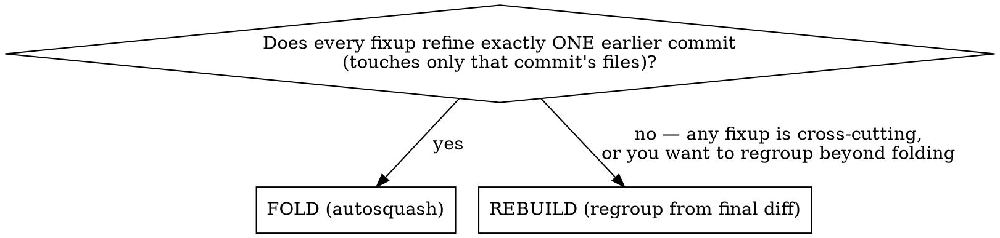

# Atomic Commits

Turn a branch's messy, iterative history into clean atomic commits before merge. This skill decides the strategy for you: **fold** clean fixups via autosquash, or **rebuild** the structure from the final diff when the mess is tangled — then runs the same safety spine either way (backup → execute → zero-diff verify → force-push → PR comment).

Replaces the earlier `cleanup-history` (fold-only) and `restructure-commits` (rebuild-only) skills.

## What "atomic" means

A commit is atomic when it's the **smallest self-standing unit of value on one concern — no smaller, no larger.** Four tests:

- **One concern** — does one logical thing; a reviewer reads it as a single thought.
- **Stands alone** — builds and passes on its own; depends on no later commit.
- **Reverts clean** — `git revert` leaves a coherent state, no orphaned half.
- **Worth its own line** — if you'd ask *"why is this separate?"* → fold it up; if you'd ask *"wait, what else does this do?"* → split it.

Everything downstream resolves from these. The grouping rules are their corollaries:

- **Group by concern, not chronology** — a review-fix belongs *in* the feature it fixes, not as a trailing commit.
- **Default to file cohesion** — keep a file's changes in one commit; split a file across commits only when a hunk is a genuinely distinct *cross-cutting* concern (the coupling test: a change welded to a feature's control flow stays with the feature; an independent multi-file concern gets its own commit).
- **Keep tests / types / docs with the code they serve.**

## Git workflow context

Fork-based: contributors push to their fork (`origin`) and open PRs against `upstream`.
- **Base branch**: `upstream/main` if `upstream` exists, else `origin/main`.
- **Push target**: always the fork the PR head lives on.

## Phase 1: Setup & rebase guard

```bash
git remote | grep -q upstream && BASE=upstream/main || BASE=origin/main
git fetch $(echo $BASE | cut -d/ -f1)
```

Find the PR: use `$ARGUMENTS` if given, else `gh pr list --head "$(git branch --show-current)" --json number,title,url --limit 1`. If none, the skill still runs — just skip the PR comment at the end.

**Rebase guard.** If the branch is behind base, STOP and tell the user to run `rebase-pr` first, then re-run this. Keep rebase and history-rewrite as separate operations with distinct force-pushes.

```bash
git log --oneline HEAD..$BASE | wc -l   # must be 0 to proceed
```

Gather the data you'll classify:

```bash
git log --oneline --stat $BASE..HEAD                 # commits + files each touches
git log --format="%H %s%n%n%b%n---" $BASE..HEAD      # full messages
```

## Phase 2: Assess & pick strategy

Classify each non-foundational commit as a **fixup candidate** (fixes/refines/cleans earlier work — messages like `fix:`, `nit:`, "address review", "remove unused", "simplify") or a **standalone** logical change. For each fixup, find its target(s) by which earlier commit's files it modifies.

Then pick the path — the whole point of this skill is that **you** decide, not the user:



- **FOLD** — every fixup is a clean *single-parent* fixup; the standalone commits are already the atomic set. Autosquash can represent it exactly.
- **REBUILD** — any fixup patches multiple earlier commits, commits overlap in scope for one concern, or the atomic grouping differs from chronological order. Autosquash can't split one fixup's hunks across parents, so rebuild the whole structure from the final diff, grouped by concern.

## Phase 3: Present the plan & get approval

Show current → proposed history. For **FOLD**, list which fixup folds into which target. For **REBUILD**, list the proposed commits with their files and one-line rationale, and note any file that lands in two commits (with why). **Get explicit approval before any mutation** — the user may reassign a fixup, keep something standalone, or regroup.

## Phase 4: Backup

```bash
ORIGINAL_TIP=$(git rev-parse HEAD)
git branch backup/atomic-$(git branch --show-current) "$ORIGINAL_TIP"
```

Tell the user the backup exists (recover any time with `git reset --hard backup/atomic-<branch>`). Optionally `git push origin` it for off-machine safety.

## Phase 5: Execute

### FOLD path

Reorder so each fixup immediately follows its target and mark it `fixup`, applied non-interactively:

```bash
git commit --fixup=<target-sha>     # if you need to (re)create the fixup markers, OR
GIT_SEQUENCE_EDITOR='bash /tmp/rebase-editor.sh' git rebase -i $BASE   # script rewrites the todo:
                                    # place each fixup after its target, change pick→fixup
```

If conflicts occur, STOP — show the files, remind the user of the backup and `git rebase --abort`; do not auto-resolve.

### REBUILD path

Reset all branch changes onto the current base as unstaged edits, then re-commit by concern:

```bash
git reset --soft $BASE && git reset -q HEAD     # all changes now unstaged on top of base
git status --short                              # ONLY the PR's files should appear
```

Stale-base artifacts (files the PR never touched but show up because the base moved) → `git checkout -- <file>` to discard before committing. Then, in dependency order (a commit must not reference something added in a later commit):

```bash
git add <files for concern 1> && git commit -m "<message>"
git add <files for concern 2> && git commit -m "<message>"
# ...
git status --short                              # empty (bar untracked non-PR files) when done
```

**Preserve authorship** if the person rebuilding differs from the original author:

```bash
git rebase --onto $BASE $BASE HEAD --exec "git commit --amend --no-edit --author=\"<Name> <email>\""
```

## Phase 6: Verify (zero diff — the safety check)

The rewrite must change **history only, never code**:

```bash
git diff backup/atomic-<branch> HEAD        # MUST be empty
```

**If non-empty, STOP** and show the diff — something was miscommitted. Do not push. Re-run the project's build/tests too if quick.

## Phase 7: Push & compare link

```bash
REMOTE_SHA=$(git ls-remote <fork-url> <branch> | cut -f1)
git push --force-with-lease=<branch>:$REMOTE_SHA <fork-url> HEAD:<branch>
```

Build the compare link from the **upstream** repo (where the PR lives), full 40-char SHAs, two dots:
`https://github.com/<upstream-owner>/<repo>/compare/<OLD>..<NEW>` — it should show **no file changes**, confirming history-only.

## Phase 8: PR comment (if a PR exists)

Draft, **show the raw markdown for approval, then post**. Use bullet lists (not code fences) so GitHub auto-links SHAs.

```markdown
Restructured the branch from <N> into <M> clean atomic commits (history-only, no code changes):

- <sha> <message>
- <sha> <message>

<one line: what folded/regrouped into what>

Previous tip preserved at `backup/atomic-<branch>`; verified byte-identical (`git diff <compare>` is empty).
```

```bash
gh pr comment <PR#> --body "<approved-comment>"
```

## Phase 9: Cleanup

Keep the local backup until the PR merges; then `git branch -D backup/atomic-<branch>` (and delete any pushed copy).

## Notes / red flags

- **Never push without a zero-diff check** — an atomic-commits run that changes code is a bug, not a cleanup.
- **Never rewrite or push or comment without user approval** of the plan / comment.
- Always `--force-with-lease`, never bare `--force`.
- 1 commit, or already-atomic history → nothing to do; say so and exit.
- Fold guard: if a "fixup" touches files from two earlier commits, it is **not** single-parent → switch to REBUILD, don't force it into autosquash.
- Rebase and history-rewrite stay separate operations (Phase 1 guard) so each has its own force-push and compare link.
